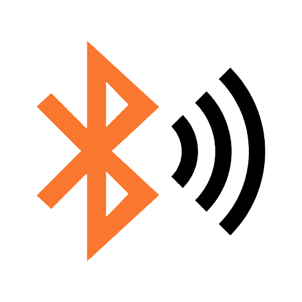
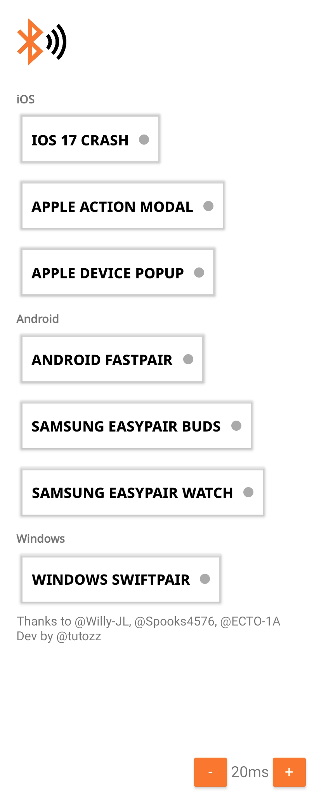
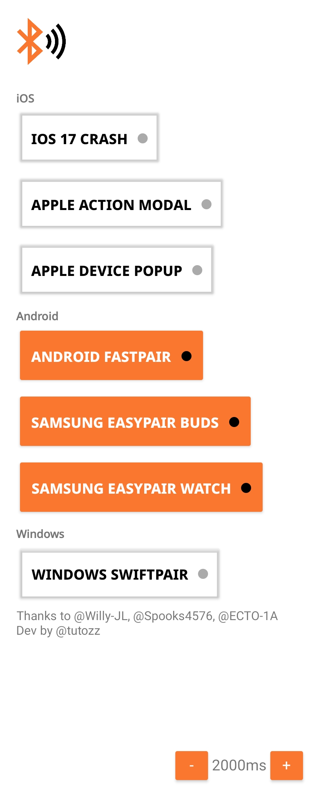
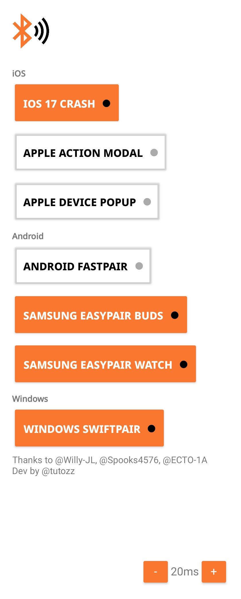

# BLE Spammer App 📡

## 概述  📋
🕵️‍♂️ 基于 [Willy-JL](https://github.com/Willy-JL), [Spooks4576](https://github.com/Spooks4576),  和 [ECTO-1A](https://github.com/ECTO-1A), 的工作, 这款 Android 应用程序扩展了 Flipper Zero BLE Spam 工具的功能，可在各种设备和操作系统上实现协议欺骗。它目前支持Apple连续性协议，Google快速配对协议，Samsung EasySetup协议和Microsoft SwiftPair协议。

## 主要特点 🔑
### Apple 连续性协议欺骗 🍏
- iOS 和 iPadOS 设备上的“欺骗附近操作”模式和“邻近感应对”弹出窗口。.
- 在 iOS 17（iPhone 12 或更高版本）上触发系统崩溃，导致重新启动.

### 谷歌快速配对协议欺骗 🤖
- 模拟 Google 快速配对协议，与大多数现代 Android 手机兼容.
- 超过 195 种不同的设备被欺骗.

### Samsung EasySetup 协议欺骗  📲
- 模仿 Buds 和 Watch 设备的 Samsung EasySetup 协议.
- 对于Android来说，最有效的方法，目标手机/平板电脑在激活时实际上无法使用.

### Microsoft SwiftPair 协议欺骗  💻
- 欺骗 Microsoft 的 SwiftPair 协议，简化 Windows 上的设备配对.
- 使用您选择的名称欺骗设备.

## 要求 📦
- Android 8.0（API 级别 26）或更高版本

## 安装  🚀
通过两种简单的方法开始使用 BLE Spammer 应用程序:

### 预建 APK（推荐） 📦
-从 [Release section](#)下载.

### 从源码🛠️构建 🛠️
- 克隆此代码库并在 Android Studio 中打开它.
- 编译应用程序以创建自定义 APK.

## 用法  🚀
像专业人士一样尝试 BLE 协议欺骗:

1. 启动应用程序.
2. 配置每个数据包之间的延迟 (推荐: 500ms 或 1000ms).
3. 从可用选项中选择要欺骗的协议.

**注意**: 组合使用多种协议以获得最大的灵活性（性能可能会受到影响）.

## 定制  🛠️
虽然当前版本提供数据包延迟自定义，但未来的更新承诺提供更多微调选项。🚀 邀请开发人员和贡献者扩展 BLE 协议欺骗的领域并揭示其隐藏的复杂性.

## 已知限制 ⚠️
以下是您应该了解的内容:

- 仅限于设备的内部蓝牙天线，导致操作范围有限.
- 硬件限制可能会影响范围、速度和有效性.

## 截图 📸
以下是该应用运行的一些屏幕截图:

**注意**: 此存储库仅用于教育目的。维护者不对因应用本准则而产生的任何误用或后果负责.

---
**免责声明**: 使用此应用程序时，请遵守适用的法律和法规。非法或不当使用可能会导致严重的法律后果。

您的专业知识和贡献有助于塑造 BLE 协议探索的未来。让我们一起突破这项迷人技术的界限! 🌐🔍
